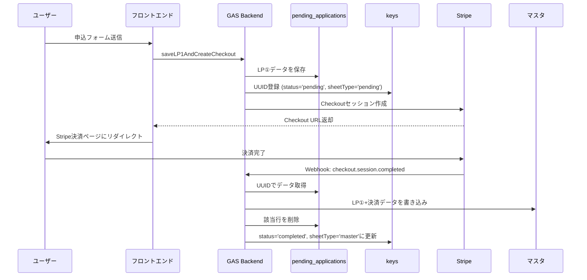
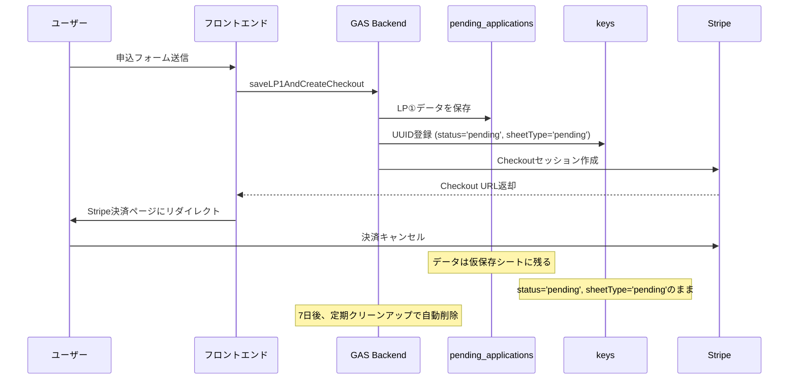

# 🏗️ 一時シート方式アーキテクチャ

## 📋 概要

**決済が完了した申込データのみをマスタシートに保存する**仕組みです。

決済キャンセルされた申込はマスタシートに記録されないため、データベースがクリーンに保たれます。

---

## 🗂️ シート構成

### 1. `pending_applications` シート（仮保存シート）
**目的**: 決済前の申込データを一時保存

| 列 | 内容 | 説明 |
|---|---|---|
| G〜AA | LP①データ | 申込フォームから送信されたデータ |
| AB〜AF | （空） | 決済完了後にマスタシートに移動するため、ここでは空 |

**ライフサイクル**:
```
申込フォーム送信 → pending_applicationsに保存
    ↓
決済完了 → マスタシートに移動 & pending_applicationsから削除
    ↓
決済キャンセル → pending_applicationsに残る（7日後に自動削除）
```

---

### 2. `マスタ` シート（本番データ）
**目的**: 決済完了した申込データを保存

| 列 | 内容 | 説明 |
|---|---|---|
| G〜AA | LP①データ | 仮保存シートからコピーされたデータ |
| AB〜AF | 決済データ | Stripe Customer ID、Subscription IDなど |

**特徴**:
- **決済完了したデータのみが記録される**
- 決済キャンセルのデータは一切入らない
- クリーンなマスタデータベース

---

### 3. `keys` シート（UUID管理）
**目的**: UUIDと行番号の対応表

| 列 | 内容 | 説明 |
|---|---|---|
| A | uuid | 申込ID |
| B | rowIndex | シート内の行番号 |
| C | createdAt | 作成日時 |
| D | status | ステータス（pending / completed） |
| E | sheetType | データの保存場所（pending / master） |

**ステータス遷移**:
```
申込時: status='pending', sheetType='pending'
   ↓
決済完了: status='completed', sheetType='master'
```

---

## 🔄 データフロー

### ✅ 正常フロー（決済完了）



---

### ❌ キャンセルフロー



---

## 🛠️ 主要関数

### 1. `saveApplicationDataLP1(record)`
**目的**: LP①データを仮保存シートに保存

```javascript
function saveApplicationDataLP1(record) {
  // 1. pending_applicationsシートに保存
  // 2. keysシートにUUID登録 (status='pending', sheetType='pending')
  // 3. UUIDを返却
}
```

---

### 2. `moveFromPendingToMaster(uuid, paymentData)`
**目的**: 仮保存シートからマスタシートにデータを移動（決済完了時）

```javascript
function moveFromPendingToMaster(uuid, paymentData) {
  // 1. pending_applicationsから該当行を取得
  // 2. マスタシートに新規行を作成
  // 3. LP①データ（G〜AA）をコピー
  // 4. 決済データ（AB〜AF）を書き込み
  // 5. pending_applicationsから該当行を削除
  // 6. keysシートを更新 (status='completed', sheetType='master')
}
```

---

### 3. `handleCheckoutCompleted(session)`
**目的**: Stripe Webhook処理（決済完了時）

```javascript
function handleCheckoutCompleted(session) {
  // 1. Stripeから決済データを取得
  // 2. moveFromPendingToMaster()を呼び出し
  // 3. ログ記録
}
```

---

### 4. `cleanupOldPendingData()`
**目的**: 古い仮保存データを削除（7日以上経過）

```javascript
function cleanupOldPendingData() {
  // 1. keysシートで7日以上経過したpendingデータを検索
  // 2. pending_applicationsから削除
  // 3. keysシートから削除
  // 4. ログ記録
}
```

**トリガー設定推奨**: 毎日深夜1回実行

---

## 📊 シート例

### ✅ 決済前（pending_applicationsシート）

| A | B | ... | G | H | ... | AA | AB | AC | ... |
|---|---|---|---|---|---|---|---|---|---|
| | | | 個人 | 青色 | ... | ¥10,000 | | | |
| | | | 法人 | 白色 | ... | ¥20,000 | | | |

### ✅ 決済後（マスタシート）

| A | B | ... | G | H | ... | AA | AB | AC | AD | AE | AF |
|---|---|---|---|---|---|---|---|---|---|---|---|
| | | | 個人 | 青色 | ... | ¥10,000 | completed | pi_xxxxx | 2025-10-24 | cus_xxxxx | sub_xxxxx |

### ✅ keysシート

| uuid | rowIndex | createdAt | status | sheetType |
|---|---|---|---|---|
| abc-123-def | 2 | 2025-10-24T10:00:00Z | completed | master |
| xyz-456-ghi | 3 | 2025-10-24T11:00:00Z | pending | pending |

---

## 🎯 メリット

### 1. **マスタシートがクリーン**
決済キャンセルのデータがマスタシートに入らないため、管理が容易。

### 2. **データ損失なし**
Webhook到着前のデータも仮保存シートに安全に保管されている。

### 3. **デバッグ容易**
`pending_applications`シートを見れば、決済待ちのデータが一目でわかる。

### 4. **自動クリーンアップ**
`cleanupOldPendingData()`で古いデータを自動削除。

### 5. **ロールバック可能**
万が一問題があっても、仮保存シートから復元できる。

---

## 🧪 テスト手順

### テスト1: 申込フォーム送信
```
1. フロントエンドから申込フォーム送信
2. pending_applicationsシートに新しい行が追加されることを確認
3. keysシートにUUIDが登録されることを確認 (status='pending', sheetType='pending')
4. マスタシートには何も追加されていないことを確認
```

### テスト2: 決済完了
```
1. Stripe Checkoutで決済完了
2. マスタシートに新しい行が追加されることを確認
3. 決済データ（AB〜AF列）が記録されることを確認
4. pending_applicationsシートから該当行が削除されることを確認
5. keysシートのstatusが'completed'、sheetTypeが'master'に更新されることを確認
```

### テスト3: 決済キャンセル
```
1. Stripe Checkoutでキャンセル
2. pending_applicationsシートにデータが残ることを確認
3. マスタシートに何も追加されていないことを確認
4. keysシートのstatusが'pending'のまま確認
```

### テスト4: クリーンアップ
```
1. 古いpendingデータを手動で作成（createdAtを8日前に設定）
2. cleanupOldPendingData()を実行
3. pending_applicationsシートから削除されることを確認
4. keysシートから削除されることを確認
5. webhook_logsシートにクリーンアップログが記録されることを確認
```

---

## 🔧 トリガー設定

### 自動クリーンアップトリガー

Google Apps Scriptエディタで設定：

```
1. トリガーを追加
2. 実行する関数: cleanupOldPendingData
3. イベントのソース: 時間主導型
4. 時間ベースのトリガー: 日タイマー
5. 時刻: 深夜0時〜1時
6. 保存
```

---

## ⚠️ 注意事項

### 1. 行削除の影響
`pending.deleteRow()`を実行すると、それ以降の行番号がずれます。
→ **下から上に向かって処理**することで対応済み（`cleanupOldPendingData`）

### 2. 同時アクセス
複数のWebhookが同時に到着した場合、行番号のずれが発生する可能性があります。
→ GASは基本的にシングルスレッドなので問題なし

### 3. UUID重複
Utilities.getUuid()は衝突がほぼ起きない設計ですが、万が一重複した場合はエラーになります。
→ 実運用で発生する確率は極めて低い

---

## 🆘 トラブルシューティング

### 問題1: 決済完了後もマスタシートに記録されない
**原因**: Webhook到達前にタイムアウト、またはエラー
**確認事項**:
- `webhook_logs`シートでエラーを確認
- `moveFromPendingToMaster`のログを確認
- Stripe DashboardでWebhook配信ステータスを確認

### 問題2: pending_applicationsシートが肥大化
**原因**: クリーンアップが実行されていない
**対処法**:
- `cleanupOldPendingData()`を手動実行
- トリガーが設定されているか確認

### 問題3: データが二重に記録される
**原因**: Webhookが重複配信された
**対処法**:
- `handleCheckoutCompleted`で既にsheetType='master'の場合はスキップする処理を追加（実装済み）

---

## 📝 変更履歴

| 日付 | バージョン | 変更内容 |
|---|---|---|
| 2025-10-24 | v18 | 一時シート方式を実装 |
| 2025-10-24 | v18 | Webhook詳細ログ機能追加 |
| 2025-10-24 | v18 | クリーンアップ関数追加 |

---

**作成日**: 2025-10-24  
**バージョン**: v18  
**対象GAS**: Code.gs (一時シート方式 + Webhook詳細ログ)


