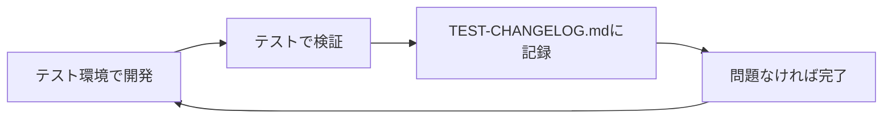
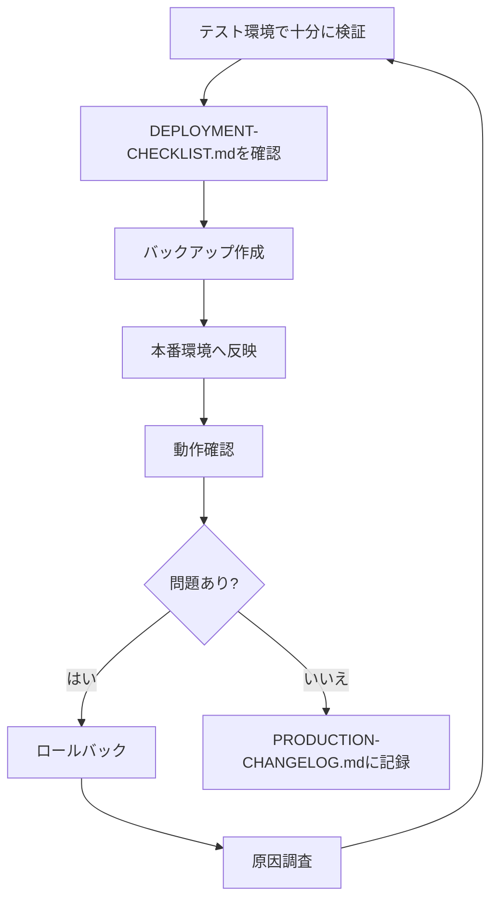

# 📚 みんなの税務顧問 - ドキュメント集

このフォルダには、本番環境とテスト環境の管理に必要な全てのドキュメントが含まれています。

---

## 📑 ドキュメント一覧

### 🎯 セットアップガイド

| ドキュメント | 説明 | 対象者 |
|---|---|---|
| [PRODUCTION-SETUP.md](./PRODUCTION-SETUP.md) | 本番環境のセットアップと管理 | 管理者 |
| [TEST-SETUP.md](./TEST-SETUP.md) | テスト環境のセットアップと管理 | 開発者 |

### 📝 変更履歴

| ドキュメント | 説明 | 更新頻度 |
|---|---|---|
| [PRODUCTION-CHANGELOG.md](./PRODUCTION-CHANGELOG.md) | 本番環境の変更履歴 | 本番反映時 |
| [TEST-CHANGELOG.md](./TEST-CHANGELOG.md) | テスト環境の変更履歴 | 変更時（随時） |

### ✅ 運用ガイド

| ドキュメント | 説明 | 使用タイミング |
|---|---|---|
| [DEPLOYMENT-CHECKLIST.md](./DEPLOYMENT-CHECKLIST.md) | 本番反映チェックリスト | 本番反映時 |
| [TROUBLESHOOTING.md](./TROUBLESHOOTING.md) | トラブルシューティング | 問題発生時 |

---

## 🔄 運用フロー

### 日常的な開発フロー

### 本番反映フロー

---

## 🌐 環境の違い

### 本番環境 vs テスト環境

| 項目 | 本番環境 | テスト環境 |
|---|---|---|
| **用途** | 実際の顧客が使用 | 開発・検証 |
| **Google Sheets** | 本番用スプレッドシート | テスト用スプレッドシート |
| **Apps Script** | Code.gs（本番用） | Code-test.gs（テスト用） |
| **HTML** | 1218tst.html lp2-detail.html | 1218tst-test.html lp2-detail-test.html |
| **Stripe** | test→live（予定） | 常にtest |
| **更新頻度** | 慎重に（検証後） | 随時（自由に） |
| **特別機能** | なし | 🧪 `tak`認証 🧪 仮UUID生成 |

---

## 🎯 クイックスタート

### 新しくチームに参加した方へ

1. **環境を理解する**
   - [PRODUCTION-SETUP.md](./PRODUCTION-SETUP.md) を読む
   - [TEST-SETUP.md](./TEST-SETUP.md) を読む

2. **テスト環境でテスト**
   - テスト用HTMLにアクセス
   - LP2で `tak` を使ってテスト
   - データがテスト用Sheetsに保存されることを確認

3. **開発を開始**
   - テスト環境で自由に実験
   - [TEST-CHANGELOG.md](./TEST-CHANGELOG.md) に変更を記録

---

## 📞 問い合わせ先

### 技術的な質問

- **Email**: minzei@solvis-group.com
- **対応時間**: 平日 9:00-18:00

### 緊急時

- **Email**: minzei@solvis-group.com
- **件名**: 【緊急】システムエラー
- **記載内容**:
  - 発生日時
  - エラー内容
  - 影響範囲
  - スクリーンショット

---

## 📖 関連リンク

### 本番環境

- [本番用スプレッドシート](https://docs.google.com/spreadsheets/d/19YI0cjUlgznSX-T3KA8AuknTjNlmHMuQHBfoXKZTBdg/edit?usp=sharing)
- [本番用Apps Script](https://script.google.com/home/projects/18OwxBYQYtSQ_M9FLNdChGZmfDUh7G3RJrxviB3XMSMxrziXgweqMqJgF/edit)
- [本番用LP1](https://minna-no-zeimu-komon.vercel.app/1218tst.html)
- [本番用LP2](https://minna-no-zeimu-komon.vercel.app/lp2-detail.html)

### テスト環境

- [テスト用スプレッドシート](https://docs.google.com/spreadsheets/d/1uYoIdPx9gq0t0d-wnJLuA799ynUbYMoJtQew0ltRkM4/edit?gid=1371411121#gid=1371411121)
- [テスト用Apps Script](https://script.google.com/home/projects/1AubHBmTJP3nCob5X5PldKmdzZRYOBCaACFc7uOBuk6zn0MiXMbZMi-8k/edit)
- [テスト用LP1](https://minna-no-zeimu-komon.vercel.app/1218tst-test.html)
- [テスト用LP2](https://minna-no-zeimu-komon.vercel.app/lp2-detail-test.html)

### 外部サービス

- [Stripe Dashboard](https://dashboard.stripe.com/)
- [Vercel Dashboard](https://vercel.com/solvis/minna-no-zeimu-komon)

---

## 🔐 セキュリティに関する注意事項

### ⚠️ 絶対に公開しないもの

- Stripe API Keys（シークレットキー）
- Stripe Webhook Secret
- スクリプトプロパティの値
- 顧客の個人情報
- GASのスクリプトID（内部使用のみ）

### ✅ 公開しても良いもの

- 本ドキュメント（API Keyを除く）
- フロントエンドのHTMLコード
- デプロイ手順
- トラブルシューティング情報

---

## 📊 統計情報

### システム構成

- **フロントエンド**: HTML + JavaScript（Vanilla）
- **バックエンド**: Google Apps Script
- **データベース**: Google Sheets
- **決済**: Stripe Checkout + Webhooks
- **ホスティング**: Vercel
- **バージョン管理**: Git

### 現在の状態

- **本番環境バージョン**: v33
- **テスト環境バージョン**: v1
- **最終更新日**: 2025-10-29
- **管理者**: （担当者名）

---

## 🎓 用語集

| 用語 | 説明 |
|---|---|
| **LP1** | ランディングページ1（申し込みフォーム） |
| **LP2** | ランディングページ2（詳細情報入力ページ） |
| **GAS** | Google Apps Script |
| **UUID** | 一意の識別子（Universally Unique Identifier） |
| **Webhook** | イベント駆動型のHTTPコールバック |
| **冪等性（Idempotency）** | 同じ操作を複数回実行しても結果が変わらない性質 |
| **Session ID** | Stripe Checkoutセッションの識別子 |

---

## 🚀 今後の予定

### 短期（1-2週間）

- [ ] テスト環境での検証完了
- [ ] 本番環境への初回反映
- [ ] Stripe本番モード（live）への切り替え

### 中期（1-3ヶ月）

- [ ] 自動バックアップ機能の実装
- [ ] エラー通知機能の実装
- [ ] 管理画面の作成

### 長期（3ヶ月以降）

- [ ] API の REST化
- [ ] データベースの最適化
- [ ] パフォーマンス改善

---

**最終更新日**: 2025-10-29  
**バージョン**: v1.0  
**作成者**: AI Assistant  
**管理者**: （担当者名を記入）

